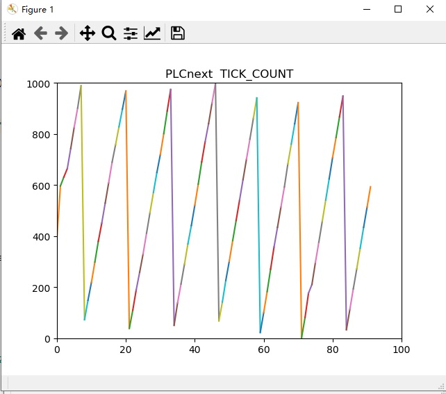

songyantao@phoenixcontact.com.cn

**Now for internal use only**  V0.4
## set up variables on PLC and give them HMI_Tag :

  ```
         |---global    
            |-A (DWORD)
            |-B (TIME)
            |-C (BOOL)
            |-F (LINT)
            |---MainInstance
               |-Value1 (INT)
               |-Value2 (REAL)
               |-Value3 (STRING)

```  

## Run `RESTdemo.py`

output:
```

异常处理实验
If there is no variable called 'AAA',you will see the following message
	invalidNames
Here we can get the variables' type of group
组成内成员数据类型：
	{'A': 'DWORD', 'B': 'TIME', 'C': 'BOOL'}
	{'MainInstance.Value1': 'INT', 'MainInstance.Value2': 'REAL', 'MainInstance.Value3': 'STRING'}
****************************************************************************************************
get all values of group:
输出组内所有成员值:
	{'A': 2387, 'B': 0, 'C': False}
	{'MainInstance.Value1': 0, 'MainInstance.Value2': 0, 'MainInstance.Value3': 'mhtepxlcuy'}
	------
	{'A': 1974, 'B': 0, 'C': False}
	{'MainInstance.Value1': 0, 'MainInstance.Value2': 0, 'MainInstance.Value3': 'rldaeopbnx'}
	------
****************************************************************************************************
Get values by "group['member']"
直接从组内提出某一变量值
	A : 1974	B : 0	C:False
	Value1 : 0	Value2 : 0	Value3 : rldaeopbnx
	------
	A : 7	C : True	value3:dqyhizxtuc
	------
	A : 1088	C : True	value3:lpoqekcazj
	------
****************************************************************************************************
使用readDatas_dict方法：
Get variables without group by readDatas_dict
	--2838--False--0--hgkmravzxq--
使用readDatas_list方法：
Get variables without group by readDatas_list
	--2196--False--0--zstbmiacgf--
****************************************************************************************************
show the group information belongs to client:
显示客户端的所有组信息
	[{'id': 'g2822857985', 'variableCount': 3, 'uri': '192.168.124.10:443/_pxc_api/api/groups/g2822857985', 'createdTimestamp': '22857985', 'usedTimestamp': '24277341', 'accessCount': '54', 'totalTimeAverage': '0', 'totalTimeMax': '2', 'ehmiTimeAverage': '0', 'ehmiTimeMax': '1', 'gdsTimeAverage': '0', 'gdsTimeMax': '1'}, {'id': 'g2922858174', 'variableCount': 3, 'uri': '192.168.124.10:443/_pxc_api/api/groups/g2922858174', 'createdTimestamp': '22858174', 'usedTimestamp': '24277402', 'accessCount': '42', 'totalTimeAverage': '1', 'totalTimeMax': '2', 'ehmiTimeAverage': '0', 'ehmiTimeMax': '1', 'gdsTimeAverage': '0', 'gdsTimeMax': '2'}]
****************************************************************************************************
-----Enjoy !	------


```

# chart demo
 --- `chartDemo.py`
 
This Demo shows PLC's TICK_COUNT

+ Before run , creat a empty EHMI on PLCnext
+ make sure 'matplotlib' has been installed
---


---
# asynchronous
## Read
check `asynvDemo_read.py`

---
## Write

developing...